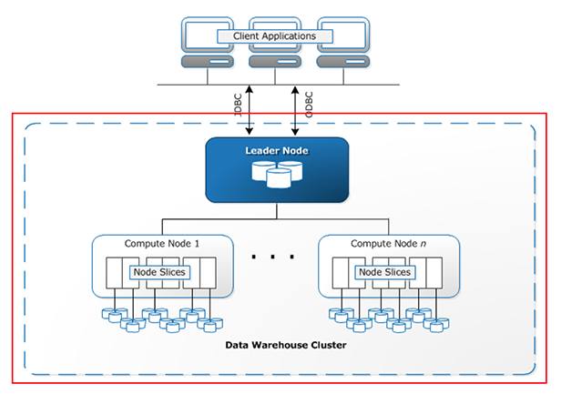
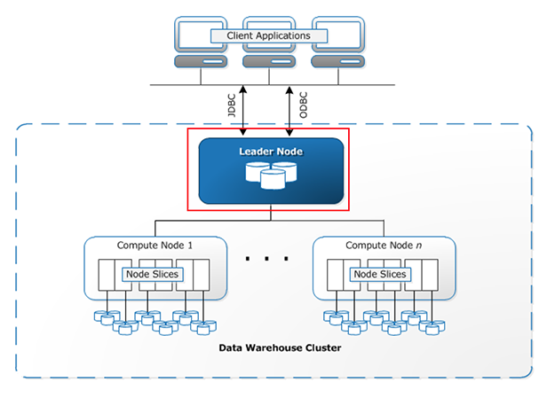
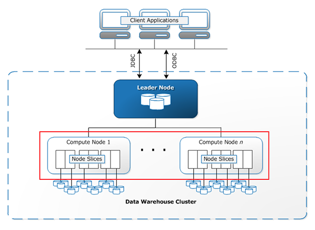
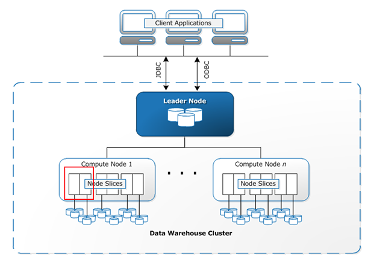
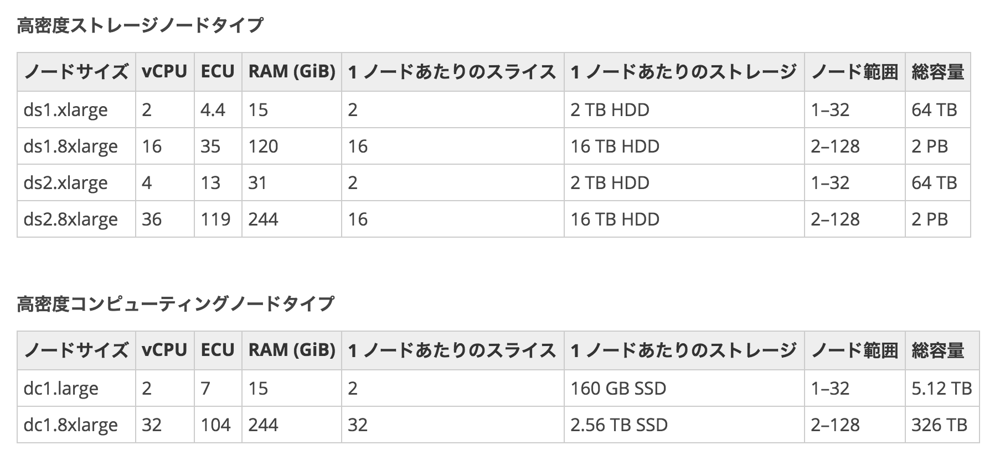
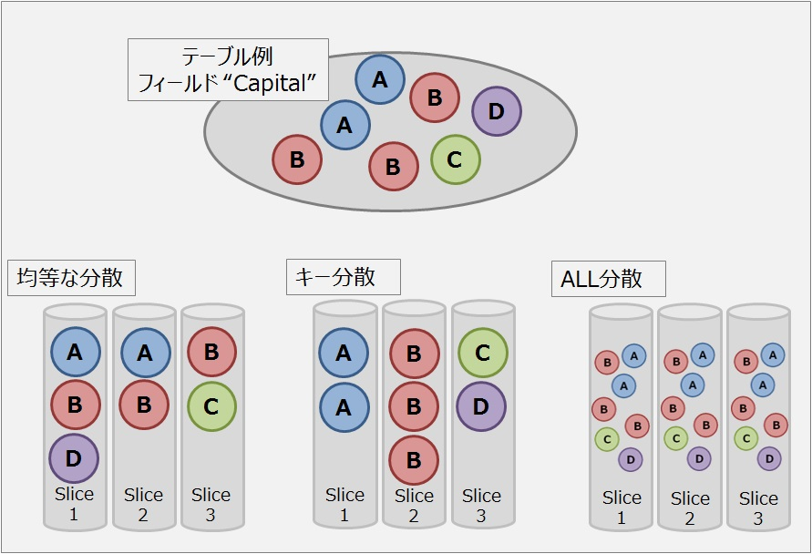
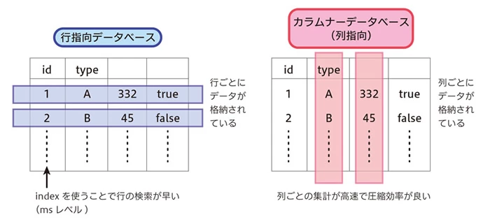

## Amazon Redshift

---
### Amazon Redshift とは

エンタープライズレベル、ペタバイト規模、完全マネージド型のデータウェアハウスサービスです(公式ガイドより)

---
### 公式動画によると
* 既存のSQLクライアントが利用可能

* ハイパフォーマンス

* 数百GB〜PT以上まで拡張可能

* コストは従来の DWH システムの1/10（らしい）

* 設定、拡張、運用が容易

---
## アーキテクチャ

---


---
#### Clusters（クラスタ）



Redshift の管理単位

---
#### Leader Node（リーダーノード）



クライアント接続、クエリ解析、コンピュートノードへのタスク割当て

---
#### Compute Node（コンピューティングノード）



リーダーノードから受け取ったタスクを処理

---
#### Node Slice（ノードスライス）



1コアあたり一つ割り当て

独立しているため、並列処理が可能

---
## スケーリング（リサイズ）

---
### クラスタタイプ

* シングルノード

* マルチノード

---

### ノードタイプ / ノード数



---
## 分散スタイル

* 均等分散

* キー分散

* ALL分散

---



---
### 均等分散

* デフォルトの方式

* ノードスライスのデータ数がほぼ均等になる様に分散

* create table で diststyle EVEN を指定するか、何も指定しない

* 結合を想定しないテーブルに適している

---
### キー分散

* 分散キーを使って各ノードスライスへの配分を決定する（分散キーはテーブルに1つ）

* create table で distkey(col) と指定する

* 通常結合対象のキーに対して指定する

---
### ALL分散

* テーブル全体がすべてのノードスライスにコピーされる

* create table で diststyle ALL を指定

* 更新頻度、範囲が低いテーブルに適している

---
### 列指向データストレージ

---


* 行単位で更新、削除をするような処理 → ×
* 列単位で集計するような処理 → ◯

---
### PostgreSQL 準拠

* PostgreSQL 8.0.2 ベース

* psql などがそのまま利用可能

---
#### ただし

* 一部機能の実装が異なる
 + COPY：S3 / DynamoDB からのロード可能

* サポートしていない機能や型、関数がある
 + 制約（主キー、Unique など）：定義可能だが、エラーとならない

---
### S3 からのデータロード例
```
copy users from 's3://awssampledbuswest2/tickit/allusers_pipe.txt'
credentials 'aws_access_key_id=<access_key_id>;aws_secret_access_key=<secret_access_key>'
delimiter '|' region 'us-west-2';
...
```

---
### 今後は
* パフォーマンスチューニング
 + ソートキー / 分散キー
 + 列圧縮

